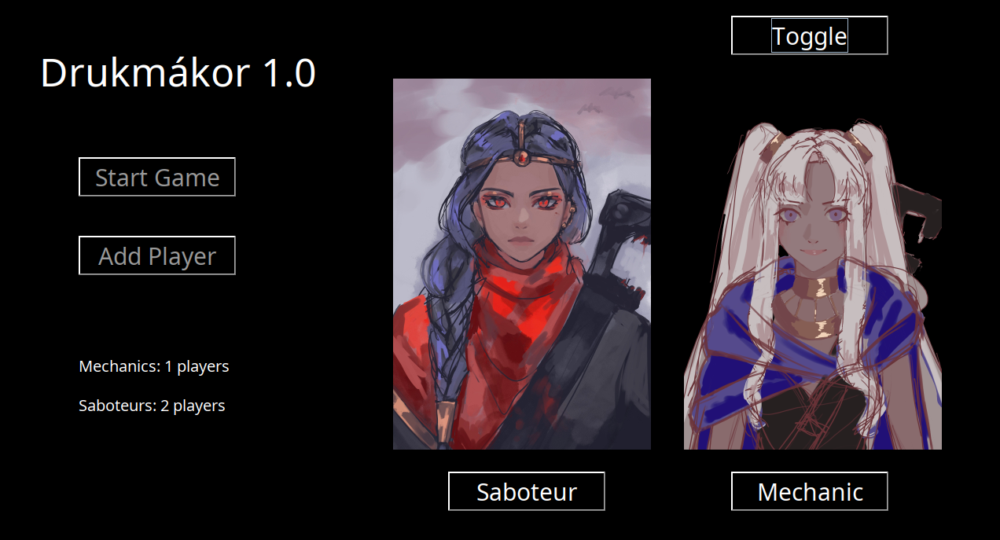
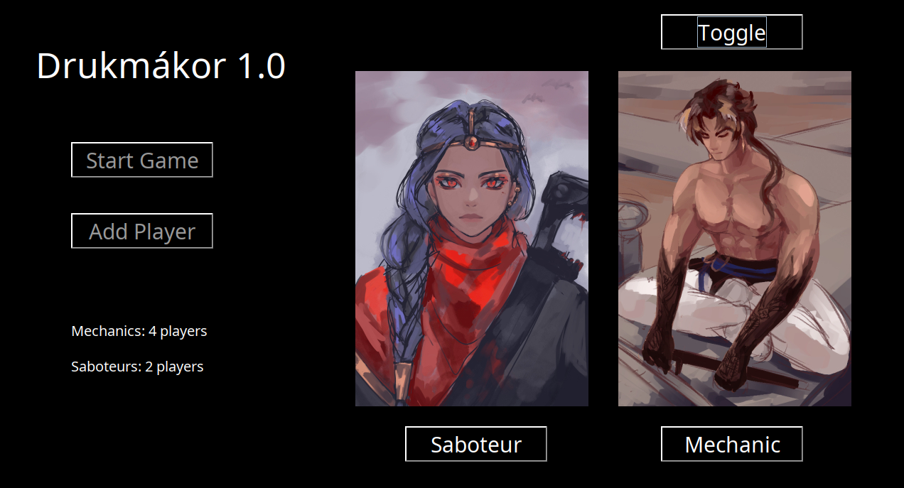

# Fordítás és futtatás

```sh
cd drukmakor
mvn package
cd ../assets
java -jar ../drukmakor/target/drukmakor-1.0-SNAPSHOT.jar
```

A programnak szüksége van képekre, és a palya.txt-re a futáshoz, ezeknek a current working directory-ban elérhetőnek kell lenniük (a fentebbi utasítások pontos végrehajtásának eredményeképp ezen fájlok megfelelő pozíciója biztosított kell legyen).

Használható parancssori argumentumok:
- `nogui`: csak parancssor
- `stdingui`: gui mellett még a parancssorból (stdin-ről) is fogad parancsokat

# Régi readme, az eredeti projekthez

BME Szoftver Projekt Laboratórium című tárgy keretében 5 fős csapatunk által elkészített dokumentációhoz tartozó forráskód.

A három branch a forráskód tárgy által megkövetelt három fázisának felel meg ([skeleton](https://github.com/4321ba/druk/tree/skeleton), [prototípus](https://github.com/4321ba/druk/tree/proto), [grafikus](https://github.com/4321ba/druk/tree/grafikus)). A main-ben egy összecsapott grafikus-kezdemény volt található, most a README-nek ad helyet.

Habár a tárgy fő célját képezi, a dokumentáció az anonimitás megőrzése céljából nem kerül feltöltésre (benne vannak a neveink és Neptun-kódjaink sok helyen).

Proto tesztelőprogram repository-ja [Stellaway-nél](https://github.com/Stellaway/DrukTest) található.

# Letölthető változatok

Lefordított változatok az összes fázishoz megtalálhatóak a [release](https://github.com/4321ba/druk/releases)-ek között. Ezeket a fájlokat használják a lentebbi példalefutások is.

Alternatívaként klónozható a megfelelő branch, és az ottani README-ben található fordítási és futtatási útmutatót követve is életre lehet kelteni a programot.

# Példalefutások, képernyőképek

A release-ek közül letölthető jar-fájlokat használva. A jar fájlok futtatásához lehet duplakattintással is próbálkozni, de ez az operációs rendszer beállításaitól függően nem biztos, hogy működni fog. Alább a `java -jar xyz.jar` parancsokat használjuk, ez jobban garantálja a sikeres indítást, és az esetleges hibaüzeneteket is egyszerűbben észrevesszük.

A `release.zip` fájl letöltése és kicsomagolása után menjünk abba a mappába a parancssorban, amiben a skeleton.jar fájl, illetve a proto és grafikus mappák találhatóak.

## Skeleton

```
$ java -jar skeleton.jar 
Welcome to Drukmákor! Do you want to see the magic behind the initialization?
 Bool value needed (printIni): false
Type in the number of your favourite sequence diagram!
 Int value needed (5.3.? (0: exit)): 1
 Int value needed (5.3.1.?): 1
--->\ Skeleton.seq_5_3_1_1()
     |--->\ Skeleton.ini_5_4_1()
Bool value needed (isOccupied): safle
Invalid input!
Bool value needed (isOccupied): false
Bool value needed (isOccupied): false
     |<---/ return
     |--->\ Mechanic@681.fix()
     |     |--->\ Pump@511.fix()
     |     |     | Bool value needed (isBroken): true
     |     |<---/ return true
     |<---/ return true
<---/ return
 Int value needed (5.3.? (0: exit)): 1
 Int value needed (5.3.1.?): 1
--->\ Skeleton.seq_5_3_1_1()
     |--->\ Skeleton.ini_5_4_1()
Bool value needed (isOccupied): false
Bool value needed (isOccupied): false
     |<---/ return
     |--->\ Mechanic@7ed.fix()
     |     |--->\ Pump@7ef.fix()
     |     |     | Bool value needed (isBroken): false
     |     |<---/ return false
     |<---/ return false
<---/ return
 Int value needed (5.3.? (0: exit)): 0
```

## Prototípus

40. teszteset mint példa, < jelzi a felhasználó parancsait, > a program válaszát.

```
$ cd proto
$ java -jar druk.jar
< add ci
> ci1
< add pu
> pu1
< add pi ci1 pu1
> pi1
< random 1
< tick ci1
< add me ci1
> me1
< pickupdanglingpipe me1 1
> true
< get me1
> ci1 pi2 null 0
< moveto me1 pi1
> true
< connectpipe me1 -1
> false
< get me1
> pi1 pi2 null 0
< moveto me1 pu1
> true
< connectpipe me1 -1
> true
< get me1
> pu1 null null 0
< get pu1
> pi1 pi2 false false 0 1
< get pi2
> ci1 pu1 false false false false false 0 0 0
< exit
```

Összes teszt futtatása:

```
$ cd proto
$ java -jar test.jar 
Testing completed.
Test results written to results/TEST_RESULT_2023_07_11_14_10_35.txt
```

Fájl tartalma:

```
TEST RESULTS @ 07/11/2023 14:10:35
Tested version: # druk-0.2

Test 1: passed!
Test 2: passed!
Test 3: passed!
Test 4: passed!
Test 5: passed!
[...]
Test 48: passed!
Test 49: passed!

All tests run. Passed 49 out of 49 tests.
Not too shabby!
```

## Grafikus

```
$ cd grafikus
$ java -jar druk.jar
```

### Főmenü





### Játék közben


### Tesztelés

A prototípus tesztelője a grafikus változat tesztelésére is alkalmas.

Ehhez a proto mappából másoljuk át az exp és inp mappákat (tesztesetek), illetve a test.jar fájlt (tesztelő program) a grafikus mappába, a druk.jar mellé.


```
$ cd grafikus
$ java -jar test.jar
Testing completed.
Test results written to results/TEST_RESULT_2023_07_11_14_26_31.txt
```

Itt már csak 38 teszteset megy át a 49-ből, balanszolás miatt állított időzítések, és szebb megjelenítést lehetővé tevő változtatások miatt. Mivel a tesztek változtatása nem volt a feladat része, ez így maradt.

# Eredeti feladatkiírás

A drukmákori sivatagon át bonyolult csőrendszer szállítja a vizet a hegyi forrásokból a sivatagon túl elterülő városok ciszternáiba. A csőrendszer egyszerű, elágazás nélküli csövekből és a csövekhez csatlakozó aktív elemekből (forrás, ciszterna, napelemmel működő vízátemelő pumpa stb.) áll. Egy pumpa több (de a pumpára jellemző véges számú) csövet is összeköthet, és minden pumpán külön-külön állítható, hogy éppen melyik belekötött csőből melyik másik csőbe pumpáljon, azonban egyszerre csak egy bemenete és egy kimenete lehet. A többi rákötött cső eközben el van zárva. A pumpák véletlen időközönként el tudnak romlani, ilyenkor megszűnik az adott pumpánál a vízáramlás. A pumpák mindegyike rendelkezik egy víztartállyal, amit a víz átemelése közben használ átmeneti tárolóként. A pumpa csak akkor tud vizet pumpálni egy csőbe, ha a cső szabad kapacitása ezt lehetővé teszi.

A csőhálózat bővíthető, változtatható. A csövek kellően rugalmasak ahhoz, hogy az egyik végüket lecsatlakoztatva egy másik aktív elemhez elvihetők és ott felcsatlakoztathatók legyenek. A ciszternáknál folyamatosan készülnek az új csövek, amelyek egyik vége a ciszternához kapcsolódik, a másik azonban szabad. A szabad végű csövekből a csőbe betáplált víz a homokba folyik.

A csőhálózatot a szerelők tartják karban. Ők javítják meg az elromlott pumpákat, ők állítják át a pumpákat, hogy mindig a lehető legtöbb víz tudjon áthaladni a hálózaton, és ha egy cső kilyukad, az ő dolguk a cső megfoltozása is. A kilyukadt csövekből a víz kifolyik, a csövek végén lévő pumpához már nem jut belőle. A szerelők dolga a ciszternáknál lévő szabad csövekkel a hálózat kapacitásának növelése. A szerelők a ciszternáknál magukhoz tudnak venni új pumpát is, amit egy cső közepén tudnak elhelyezni. A csövet ehhez ketté kell vágni, és a két végét a pumpához kell csatlakoztatni.

A hálózaton élnek a nomád szabotőrök is, akik a pumpákat tudják átállítani és a csöveket szokták kilyukasztani.

Mivel a sivatag veszélyes hely, a szerelők és a szabotőrök csak a csőhálózaton haladhatnak. A pumpáknál kikerülhetik egymást, de a csöveken már nem tudnak elmenni egymás mellett, egy csövön egyszerre csak egy ember állhat.

A játékot a két csapat legalább 2-2 játékossal játssza. A szabotőrök dolga, hogy minél több víz folyjon el a lyukakon, a szerelők pedig azon dolgoznak, hogy minél több víz jusson a ciszternákba. Az a csapat nyer, amelyik a játék végére több vizet szerez.

## Módosítás (félév közben)

- Szerelő is tud lyukasztani.
- Foltozott cső véletlen hosszúságú ideig nem lyukadhat lyukasztható ki.
- A csöveknek mindkét vége egyidőben le lehet csatolva.
- A szabotőr azt a csövet, amin áll, rövid időre csúszóssá tudja tenni. Ilyenkor aki rálép, véletlenszerűen a cső valamelyik végéhez kapcsolódó elemre kerül. 
- Mind a szabotőrök, mind a szerelők azt a csövet, amin állnak, rövid időre ragadóssá tudják tenni. Aki legközelebb rálép, egy ideig nem tud továbblépni.
